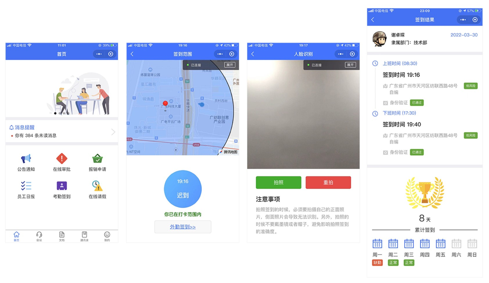

# 协同办公系统——移动端

## 背景
该项目背景主要两点：

1. 进一步熟悉前后端分离架构模式。
2. 练习以uniapp框架开发的移动端应用, 其包含小程序、公众号等等。

[协同办公系统-后端](https://github.com/bowerchen/xinlian-OA-service)

## 技能

 

 

 

 

 

 

 

 

 

## 实例
考勤签到

审批流程

